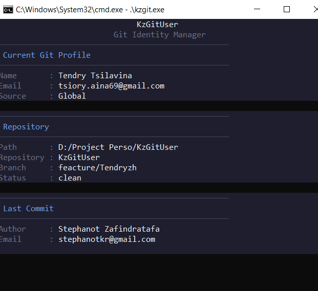

<!-- markdownlint-disable MD033 MD041 -->
<p align="center">
  
</p>

<h1 align="center">KzGitUser (kzgit)</h1>

[](https://github.com/karozadev/KzGitUser/actions/workflows/ci.yml)
[](https://github.com/karozadev/KzGitUser/actions/workflows/ci.yml)
[](https://github.com/karozadev/KzGitUser/actions/workflows/ci.yml)
[](https://github.com/karozadev/KzGitUser/releases)
[](LICENSE)

**KzGitUser** (by Karoza) is a lightweight CLI that helps you **visualize, verify and switch** your active Git identity (`user.name` / `user.email`) so you never accidentally commit to a professional repository with your personal email — or vice versa.

## The problem

Most developers juggle several Git identities: a work email, a personal one, maybe a freelance client's. Git happily lets you commit with whatever `user.name`/`user.email` is currently configured, and it's easy to forget to switch before you commit — especially across repositories with different local overrides, global defaults, and environment variables. **kzgit** makes the *active* identity visible at a glance, lets you save named profiles, switch between them in one command, and enforce rules (e.g. "this repo must use a `@company.com` email") in a hook or CI pipeline.

## Features

- **`kzgit ui`** — launch the interactive Terminal User Interface (TUI) for managing Git identities visually.
- **`kzgit whoami`** — see exactly which identity is active, and where it comes from (local, global, system, or an environment variable).
- **`kzgit profiles`** — save, list, and remove named identity profiles.
- **`kzgit switch <profile>`** — apply a saved profile to the current repository's local config in one command.
- **`kzgit check`** — validate the active identity (email set, optionally restricted to allowed domains); exit code friendly for hooks and CI.
- **`kzgit update`** — self-updates to the latest release, with a zsh-style prompt shown automatically when one is available.
- Respects Git's real config precedence (environment variables → local → global → system) instead of reimplementing it.
- Single static binary, no runtime dependencies beyond `git` itself.

## Demo

```text
$ kzgit whoami
Git Identity
────────────────────────────
Name   : John Doe
Email  : john@company.com
Source : Local Repository

Repository
────────────────────────────
Path   : /home/john/work/project
Branch : main

Last Commit
────────────────────────────
Author : John Doe
Email  : john@company.com
```

### TUI Interface

Launch the interactive TUI with:

```bash
kzgit ui
```

Or simply run `kzgit` without arguments to open the TUI directly.

The TUI provides:

- **Dashboard** — View your current Git identity, repository info, and last commit at a glance
- **Profile Management** — Create, switch, and delete profiles with keyboard shortcuts
- **Command Mode** — Type commands like `/help`, `/switch work`, `/check` for quick actions
- **Autocomplete** — Tab-complete command names as you type

#### Dashboard



#### Add Profile


#### Command Mode


#### Keyboard Shortcuts

| Key | Action |
| --- | --- |
| `1-3` | Switch between pages |
| `j/k` | Navigate lists |
| `Enter` | Select/Confirm |
| `Esc` | Back/Close |
| `/` | Command mode |
| `?` | Help |
| `q` | Quit |

## Installation

### Recommended: install script (wget)

```bash
wget -qO- https://raw.githubusercontent.com/karozadev/KzGitUser/main/install.sh | sh
```

### Install script (curl)

```bash
curl -fsSL https://raw.githubusercontent.com/karozadev/KzGitUser/main/install.sh | sh
```

### Download and inspect before running

```bash
wget https://raw.githubusercontent.com/karozadev/KzGitUser/main/install.sh
chmod +x install.sh
./install.sh
```

The script detects your OS and architecture, downloads the matching binary from the [latest GitHub release](https://github.com/karozadev/KzGitUser/releases), installs it to `/usr/local/bin` (override with `KZGIT_INSTALL_DIR`), and verifies the install. It does **not** require Go.

### go install

```bash
go install github.com/karoza/kz-git-user@latest
```

### From a precompiled release

Download the archive for your platform from the [Releases page](https://github.com/karozadev/KzGitUser/releases), extract it, and place the `kzgit` binary somewhere on your `PATH`.

### Verify the installation

```bash
kzgit version
kzgit whoami
```

### Supported platforms

| OS      | amd64 | arm64 |
| ------- | :---: | :---: |
| Linux   |  ✅   |  ✅   |
| macOS   |  ✅   |  ✅   |
| Windows |  ✅   |  ✅   |

## Usage

### Interactive TUI

The fastest way to get started is with the interactive TUI:

```bash
kzgit
# or
kzgit ui
```

The TUI opens a visual dashboard where you can:

- View your current Git identity and repository info
- Navigate between pages (dashboard, profiles, commands)
- Manage profiles with keyboard shortcuts
- Execute commands by typing `/command`

### CLI Commands

For scripting and automation, use the CLI commands directly:

### `kzgit whoami`

Shows the active identity, its source (Local Repository, Global, System, or Environment Variable), the repository path and current branch, and the last commit's author/email. Running `kzgit` with no arguments is equivalent to `kzgit whoami`.

```bash
kzgit whoami
```

### Profiles

Save named identities once, reuse them across repositories.

```bash
# Add a profile
kzgit profiles add work-corp --name "John Doe" --email "john@company.com"
kzgit profiles add personal  --name "John Doe" --email "john@gmail.com"

# List profiles
kzgit profiles list
```

```text
Profiles
────────────────────────────
personal     john@gmail.com
work-corp    john@company.com
```

```bash
# Remove a profile
kzgit profiles remove personal
```

Profiles are stored in `~/.config/kzgit/config.json` (falling back to the legacy `~/.kzgit.json` if present).

### `kzgit switch <profile>`

Applies a saved profile to the **local** config of the repository in your current directory:

```bash
kzgit switch work-corp
```

Fails clearly if you're not inside a Git repository, or if the profile doesn't exist.

### `kzgit check`

Validates the current identity — useful in a `pre-commit` hook or CI pipeline. Exits `0` when valid, `1` otherwise.

```bash
kzgit check
kzgit check --domain company.com --domain company.io
```

Example `pre-commit` hook:

```bash
#!/bin/sh
kzgit check --domain company.com || exit 1
```

You can also persist allowed domains in the KzGitUser config under a `rules.allowedDomains` array, so plain `kzgit check` enforces them without flags.

### `kzgit update`

Keeps `kzgit` itself up to date, similar to how zsh frameworks prompt you when a new version is out. Two ways it shows up:

- **On demand**: `kzgit update` checks GitHub for the latest release and, if one is available, asks for confirmation before installing it in place of the running binary (checksum-verified against the release's `checksums.txt`).
- **Automatically, at a glance**: when you run `kzgit` (the TUI) or `kzgit whoami` from an interactive terminal, kzgit does a lightweight, cached check (at most once every 24h) and offers the same prompt if a newer release exists.
- **With a changelog**: before asking to update, it prints that release's changelog (generated by GoReleaser from commit messages and published as the GitHub release's notes), so you know what's changing before you say yes.

```text
$ kzgit whoami
...
A new version of kzgit is available: v0.2.0 (you have v0.1.0).

Changelog:
  * feat(update): add self-update system
  * test: raise coverage to 85.8%

Update now? [Y/n] y
Downloading kzgit v0.2.0...
Updated to kzgit v0.2.0. This takes effect the next time you run kzgit.
```

Note that `kzgit update` only ever sees **published GitHub releases** (tagged with `vX.Y.Z`), not unreleased commits on `main` — the same source `install.sh` uses. If you're on the latest tag, there's nothing to update to yet.

```bash
kzgit update            # check and prompt before installing
kzgit update --yes      # install without prompting
kzgit update --check    # just report whether an update is available
```

The automatic check never runs in a non-interactive context (pipes, hooks, CI), and can be disabled entirely with `KZGIT_NO_UPDATE_CHECK=1`.

## Open Source

KzGitUser is open source under the [MIT License](LICENSE). Issues, feature requests, and pull requests are welcome — see [CONTRIBUTING.md](CONTRIBUTING.md) for how to get started.
